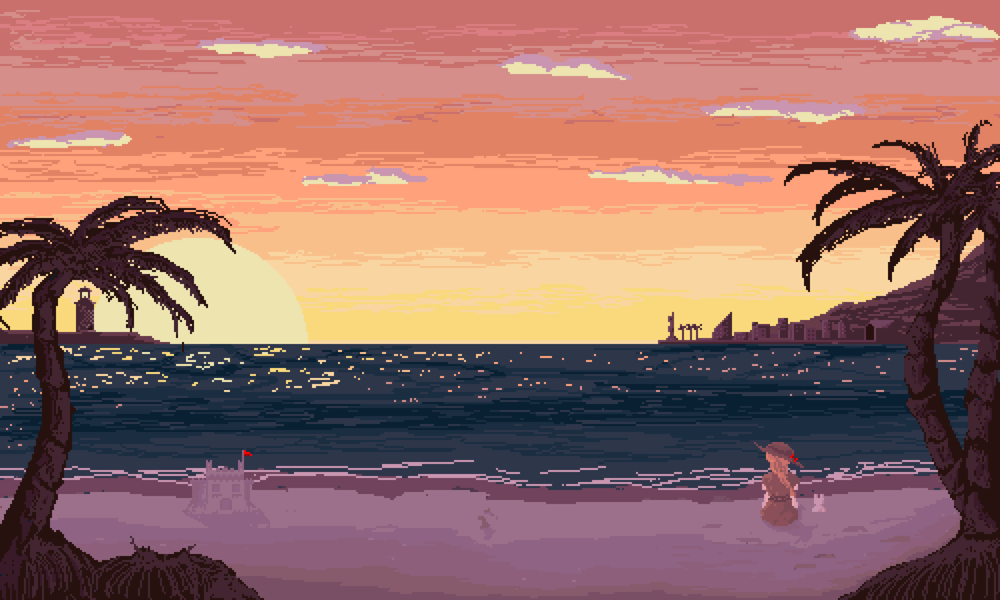

<h1 align="center">Welcome!</h1>

<h2 align="center">About Me</h2>

My name is Davis Inde Satya, I was born on August 16, 2002 and I am currently studying in Universitas Bina Nusantara majoring in computer science.
          In my free time, I enjoy learning new programming language, solving problems, as well as learning new things outside of computer science subject, such as
          philosophy, psychology, game making, and also 3D modeling. I am currently interested in learning and developing native Android application. As of now, I am currently an intern at PT. Global Loyalty Indonesia with the position of Android Developer

          <h2>Programming languages</h2>
          
          
          
          
          
          
          

          

  <h2 align="center">Stats</h2>
  
  

