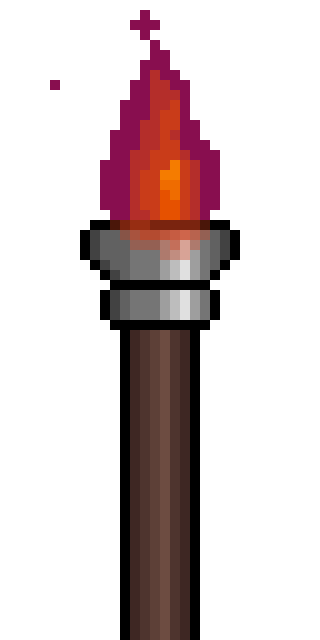

<h1 align="center">Welcome!</h1>

<h2 align="center">About Me</h2>

My name is not important. I usually have a dream of becoming an illustrator because I love to draw, then something whispers that I should be a singer instead. But it seems that fate has brought me to the world of code, something I started when I was in elementary school. As of now, I am a programmer. 
          In my free time, I enjoy learning new programming language, solving problems, as well as learning new things outside of computer science subject, such as
          drawing, singing, psychology, and also 3D modeling. I am currently interested in learning and developing native Android application, internet of things, and web development. Maybe I will try machine learning next.

Enjoy!

          

                    
                    <h2>Programming languages</h2>
          

          
          
          
          
          
          
          
          

          

  <h2 align="center">Statistics</h2>
  
  

